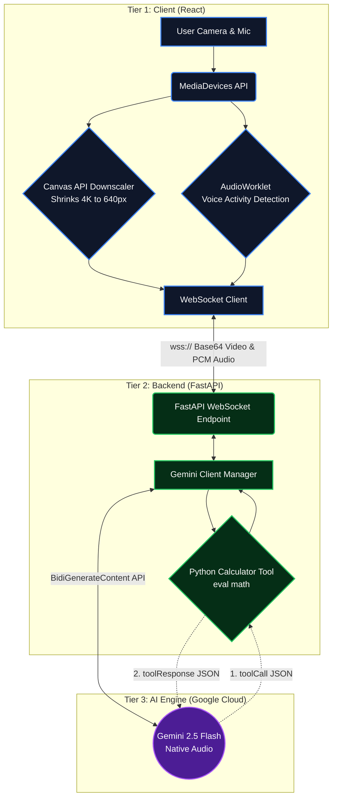

# LogicLens 🧠📷

> **A real-time, multimodal AI math tutor that sees your notebook and talks with you, using Socratic guidance to teach step-by-step instead of just giving the answer.**

LogicLens bridges the gap between pure educational pedagogy and generative AI. Powered by the Gemini Live API, it acts as a human-like tutor named **Lora**. Loraa doesn't just act like a calculator; she actively observes your handwritten equations through your camera, reads your facial expressions, and asks guiding questions to help you reach that "aha!" moment yourself.

## ✨ Key Features
* **Real-Time Multimodal Streaming:** Continuous bi-directional video and audio streaming via native WebSockets.
* **Socratic Teaching Engine:** Strictly prompted to guide students step-by-step rather than outputting the final answer.
* **Smart Frame Downscaling:** A custom Canvas API interceptor that dynamically shrinks 4K smartphone camera frames to 640px, preventing backend memory crashes.
* **Voice Activity Detection (VAD):** A custom browser `AudioWorklet` that monitors microphone input to smoothly handle human-AI interruptions.
* **Backend Python Calculator:** Because LLMs can hallucinate arithmetic, Nova is equipped with a secure Python function-calling tool. She intercepts complex math, evaluates it perfectly on the server, and speaks the accurate result.
* **Mobile-Safe Camera Switching:** A "Nuke and Rebuild" hardware toggle that safely swaps between front and rear lenses without triggering Android OS abort errors.

## 🏗️ Architecture

## 🚀 How to Use LogicLens

LogicLens is fully deployed and accessible directly in your web browser. No local installation or downloading is required!

### 1. Access the Live App
Visit the application here: **https://logiclens-omega.vercel.app/**

### 2. Grant Permissions
When prompted by your browser, **Allow** access to your camera and microphone. LogicLens requires these to see your math problems and hear your questions in real-time. All processing is handled securely, and streams are not recorded.

### 3. Start the Session
Click the **Start Session** button on the home screen. The interactive split-screen UI will load, showing your camera feed on top and Nova's AI avatar on the bottom.

### 4. Interact with Nova
* **Ask a Question:** Simply start speaking naturally. Try saying, *"Hi Nova, I need help factoring a quadratic equation."*
* **Show Your Work:** Write a math problem in dark marker on a piece of paper and hold it up to the camera.
* **Switch Cameras:** Tap the **Switch Camera** icon (top right of your video feed) to seamlessly flip to your phone's rear camera and point it down at your notebook or desk.
* **Mute Microphone:** Need a moment to think? Tap the **You / Muted** badge (top left of your video feed) to temporarily pause your microphone without disconnecting the session. Tap it again to resume speaking.
* **End Session:** When you are done learning, tap the red **Power** button below Nova's avatar to safely close the connection and turn off your camera.